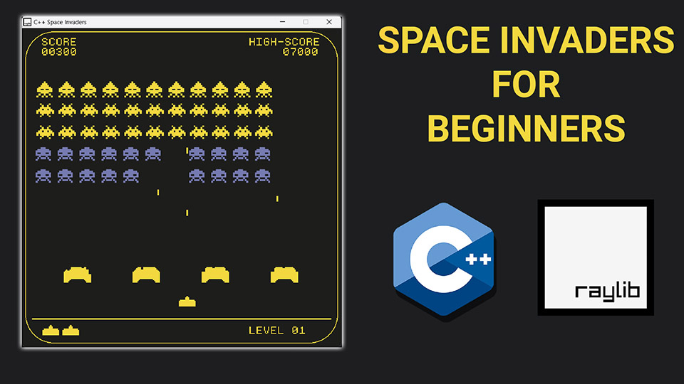

# C++ Space Invaders Game with raylib

🚀🕹️🐍 Explore the world of game development with this C++ Space Invaders Game built using the raylib library. 💻🎨🎧 This GitHub repository contains the complete source code for the game, featuring graphics, input handling, and audio. Play it on Windows, macOS, or Linux. 🎮🔍📖 If you're an aspiring game developer, this well-structured, readable code is a fantastic resource to learn pygame game programming.

For an in-depth tutorial on creating your own Space Invaders game using raylib, watch the accompanying <a href="https://youtu.be/TGo3Oxdpr5o">Video Tutorial on YouTube</a>. 🎬👨‍💻 The tutorial walks you through each code line, explaining its logic and demonstrating its impact on the game. Learn how to set up the game window, create classes for game elements, implement collision detection, and add sound effects. By the end of the tutorial, you'll have a fully functional Space Invaders game ready for play and customization. ☕ Grab a coffee and join us on an exciting journey into the world of pygame game development! 🌌

# Video Tutorial

  

🎥 <a href="https://youtu.be/TGo3Oxdpr5o">Video Tutorial on YouTube</a>

 
 

| 📺 <a href="https://www.youtube.com/channel/UC3ivOTE5EgpmF2DHLBmWIWg">My YouTube Channel</a>
| 🌍 <a href="http://www.educ8s.tv">My Website</a> |  

